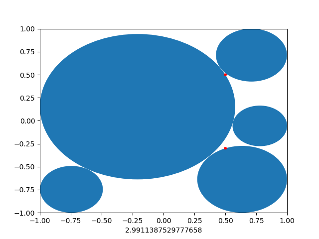

# ball_in_box lab1

## envs

    requirements.txt
    大部分主机上自带

    ide:pycharm
    ball_in_box/area_sum 是程序入口

## problem description

    二维平面上,有一个(-1,1) (1,-1)的正方形,与m个坐标(mxi,myi)
    已知有n个可变半径的 无边界圆(或者"空") 可供放置在正方形内,但不能交叠,同时不能包含上面的m个坐标;
    求所有圆的最大面积

## 朴素想法
    已知把该问题圆面积变成圆周长,是个未解决的开放问题
    所以如何快速得到更优解才是需要考虑的
    目前是三种做法,一种是随机数,一种是枚举点,一种是解方程
    用数学方法解方程组耗时最少,也最精确,但代码极长,如果输入数据固定了还好说
    枚举点普适性稍强了点,但数据稍稍一大,就超时
    随机方法应当是数据分析中最广泛使用的,且适用于n=1000的情况,同时得到的解不会太差

## 算法实现
    以下几个是不同的算法实现
    ball_in_box/ballinbox_obsolete 是简单的随机算法,来每次找一个最大圆
    ball_in_box/ballinbox_iter 是枚举点,每次找一个半径最大圆
    ball_in_box/ballinbox 是枚举之后在随机移动局部最优解,希望找到比贪心更好的方案,类似退火算法,只不过可能性实在太多..,假设n维超平面,每次找最大圆的方法是一个较高的平台,目的是从这个平台上移动到更高的平台...,实在不会写
    
# *获取所有人的成绩
参见checker,搬砖行为,
(linux)必须复制该文件夹所有东西,可以自定义area_sum.py的内容进行测试,然后

> `python main.py`
复制单个文件,有些人的测试不到

> `python main(gitclone).py`
碰到不存在的项目要手动取消git clone,而且有些人的项目巨大266兆,所以不能候着,也不能走开

# 总结
1. 用了一些必要的优化以供暴力迭代,并且把图绘出来了
2. 还做了一点微小的贡献就是让运行的时间稳定在1s内,用ax^b拟合
3. 通过特例发现,贪心算法是错误的
4. 同时随机算法不知道怎么发挥好
5. 耗费一晚上才写了个爬成绩的脚本,gg
## checker 排名部分
就这么一个简简单单的功能,我碰到了下面的合起来的特别恶心的情况,
1. 有人项目大小十几兆乃至上百兆;
2. 有人在ball_in_box.py 里面 import 其他py文件
3. 有人没有建项目,git clone 要自己手动取消
4. 有人在ball_in_box.py 里面:请输入气球数量
5. 有人超时10s
